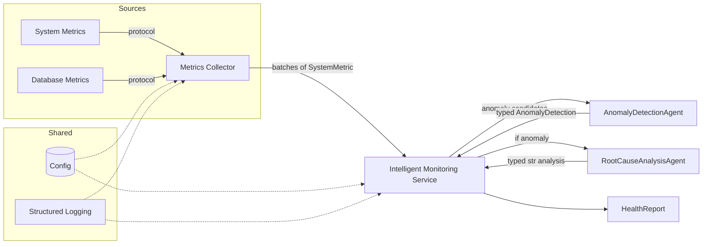

# Intelligent Health Monitor

Production-grade AI-powered system monitoring framework built with Python 3.13 and Pydantic AI.

This project demonstrates how to blend modern systems engineering practices (structured concurrency, type safety, explicit error handling) with type-checked AI analysis to produce actionable, trustworthy operational insights.

## Why this project

Traditional monitoring is great at collection but weak at understanding. Thresholds generate noise, correlation is manual, and alerts lack context. Intelligent Health Monitor addresses that gap with:

- Structured, type-safe AI analysis you can reason about and test
- Clear separation of concerns between collection, analysis, and orchestration
- Production-grade patterns: retries, timeouts, observability, graceful degradation

## Key Features

- Robust metrics collection with explicit error handling (`Result` type)
- Pluggable metrics sources via protocols (easy to add new integrations)
- Multi-agent AI analysis with typed outputs (Pydantic AI)
- Deterministic, testable prompts and validation for AI results
- Structured logging with `structlog`
- Strong type discipline (mypy strict mode) and comprehensive tests

## Architecture Overview



## Repository Structure

- `core/domain/models.py` — Typed domain models (`SystemMetric`, `AnomalyDetection`, `HealthReport`)
- `core/services/metrics_collector.py` — Concurrency-safe metrics collection framework
- `core/services/database_metrics.py` — Example database metrics source
- `core/services/ai_analysis.py` — AI agents (anomaly detection, root cause analysis) and orchestration service
- `core/config.py` — Validated configuration with environment-variable overrides
- `tests/` — Unit tests for domain, collection, database metrics, config, and AI orchestration

## Getting Started

### Prerequisites

- Python 3.13
- `uv` (recommended) or `pip`

### Install

```bash
uv sync
```

### Configure environment

Copy `.env.example` to `.env` (or set environment variables via your shell). At minimum you’ll need an OpenAI key for AI analysis demos.

### Run example demos

- Metrics collection demo:

```bash
uv run python core/services/metrics_collector.py
```

- AI analysis demo (anomaly detection + root cause analysis):

```bash
uv run python core/services/ai_analysis.py
```

These demos do not start any external services; they simulate sources and interact with configured AI providers.

## Configuration

Configuration is centralized in `core/config.py` and validated at load time.

- `ENVIRONMENT` — `development | staging | production`
- `OPENAI_API_KEY` — required for AI analysis demos
- `ANTHROPIC_API_KEY` — optional, if using Anthropic
- `ANOMALY_DETECTION_MODEL` — model id string (default: `openai:gpt-4o-mini`)
- `ROOT_CAUSE_MODEL` — model id string (default: `openai:gpt-4o`)
- `API_*` — reserved for future API server (CORS origins, port, reload)

Helper functions:

- `get_config()` — cached configuration
- `get_model_config(task)` — extracts model settings for a given task (`anomaly_detection | root_cause`)

## Testing & Quality

This repository treats testing and static analysis as first-class citizens.

- Unit tests with `pytest`, async tests with `pytest-asyncio`
- Property-based tests with `hypothesis`
- Linting with `ruff`
- Type checking with `mypy` (strict mode)

Run the full suite individually:

```bash
uv run pytest -q
uv run mypy .
uv run ruff check .
```

or simply run:

```bash
uv run pre-commit run --all-files
```

## Design Principles

- **Single Responsibility** — each component (collection, analysis, config) has a crisp API
- **Fail Fast, Degrade Gracefully** — validate upfront; during runtime prefer partial results to total failure
- **Typed AI Contracts** — AI outputs are validated with Pydantic models to prevent ambiguous strings
- **Structured Concurrency** — `asyncio.TaskGroup` patterns ensure safe startup/shutdown
- **Observability** — structured logs everywhere for real-world debugging

## Extending the System

- Add a new metrics source:
  - Implement the `MetricsSource` protocol (see `core/services/metrics_collector.py`)
  - Register it via `MetricsCollector.add_source(...)`
- Add a new AI task:
  - Create a new Agent in `core/services/ai_analysis.py` with a typed `output_type`
  - Route orchestration in `IntelligentMonitoringService`

## Roadmap

- End-to-end integrated monitoring pipeline service (combine collection + AI + alerting)
- REST API for status and reports (FastAPI)
- Pluggable persistence for metrics and analysis history (SQLite/Postgres)
- Additional sources: Kubernetes, Prometheus, cloud providers
- Alert routing: email, Slack, PagerDuty

## Security

- Never commit API keys. Use environment variables or secret managers.
- Least-privilege principle for any service accounts used by integration sources.

## Contributing

Contributions are welcome. Please:

- Open an issue to discuss substantial changes
- Include tests for new behavior
- Keep PRs focused and well-described
- Ensure `pytest`, `mypy`, and `ruff` pass locally

## License

This project is open source. See `LICENSE` for details.
